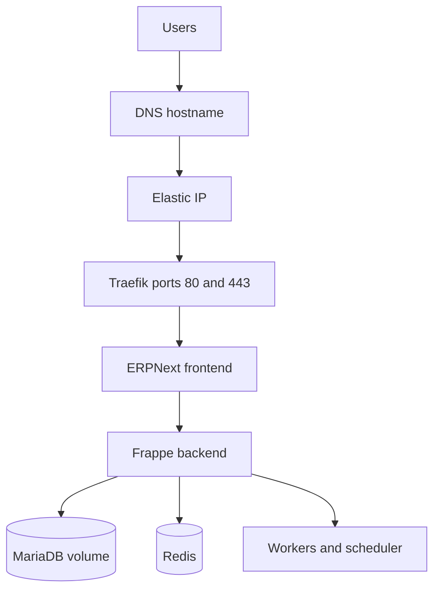

# 1. Planning and architecture

## What this deployment contains

All services run on one EC2 instance. Docker volumes persist the database, sites, logs and TLS certificate data.

## Inputs to obtain before starting

- AWS account owned by the client
- Client employee with administrator/recovery access
- AWS region closest to users
- Expected user count and workload
- ERPNext and Frappe versions to pin
- Public domain and DNS access
- Email address for Let's Encrypt notices
- Custom app repository, branch and visibility
- Backup retention and recovery requirements
- Monthly cost ceiling

## Tested version pattern

The working reference deployment used:

- ERPNext `v16.30.0`
- Frappe `v16.29.0`
- MariaDB `11.8`
- Redis `8.6-alpine`
- Traefik `v3.7`

These are examples, not an instruction to use old versions forever. Verify the compatibility of the exact pinned releases before each build.

## Why ARM64 works

The `t4g` family uses AWS Graviton and requires `linux/arm64` images. Verify every image in the stack supports ARM64. Never force an AMD64-only image onto a small ARM host through emulation for production.

## Limitations

- One EC2 failure stops the entire service.
- Database and application compete for the same CPU and RAM.
- Vertical scaling or migration is required as usage grows.
- Docker volumes are not backups.
- Deployment changes can cause short interruptions.

For larger or business-critical workloads, consider managed database services, multiple application nodes, a load balancer and independently monitored backups.
