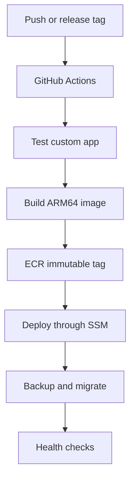

# 10. CI/CD roadmap

The manual EC2 build is suitable for initial setup but should evolve into an immutable CI/CD process.

## Recommended target flow

## AWS components

- Private Amazon ECR repository
- GitHub OIDC provider in IAM
- Least-privilege GitHub deployment role
- EC2 instance role with ECR pull and SSM permissions
- Optional S3 artifact/backup bucket

Use GitHub OIDC instead of long-lived AWS access keys. Restrict the trust policy to the exact organization, repository, branch or protected GitHub environment.

## Pipeline stages

1. Check out the deployment/custom-app repository.
2. Run unit tests and static checks.
3. Build with Buildx for `linux/arm64`.
4. Pass private repository credentials only as BuildKit or CI secrets.
5. Scan the image.
6. Push a unique immutable tag, preferably including app version and commit SHA.
7. Connect through SSM Run Command or another controlled deployment mechanism.
8. Back up the site.
9. Pull the new tag and update `.env` or the deployment manifest.
10. Run Compose validation and `up -d`.
11. Run `bench migrate` as a controlled step.
12. Perform HTTP, worker, scheduler and application smoke tests.
13. Roll back to the previous image tag if checks fail.

## Repository ownership

For client handover:

- Transfer the custom app and deployment repository to a client-controlled GitHub organization.
- Replace personal tokens and deploy keys.
- Update GitHub OIDC trust conditions.
- Ensure the client controls AWS, DNS, recovery email, ECR and backup encryption keys.
- Document who approves and performs production deployments.

## Do not automate unsafe assumptions

The pipeline should stop if backup, migration or health checks fail. Avoid automatic destructive rollback of a database after a schema migration; database recovery needs a tested restore plan.
